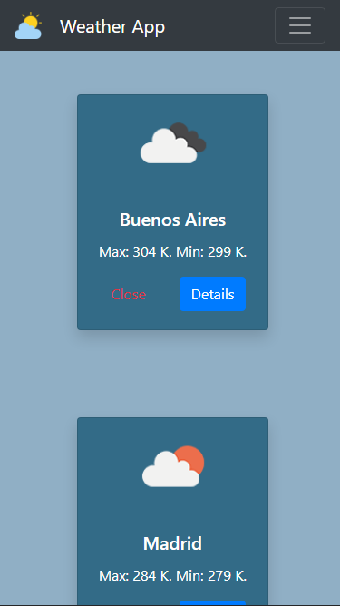
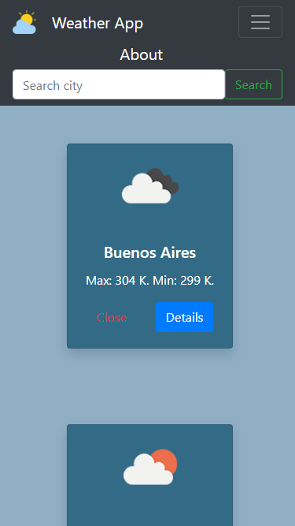
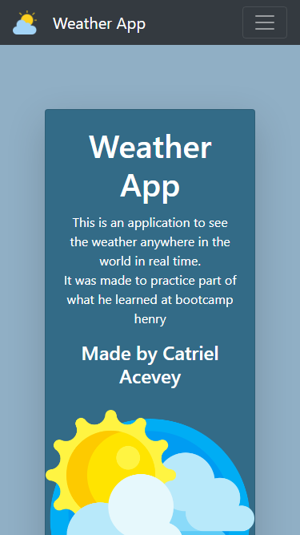

<p align='left'>
    
</p>


# Weather-APP

Esto es una aplicación React que me permite ver el clima en tiempo real de cualquier parte del mundo.

<p align="left">
  
</p>

## Tecnologías usadas

- Front End:
    + HTML - Javascript
    + CSS - Bootstrap
    + React

# Como iniciar el proyecto

 - Clonar el repositorio en su computadora
 - Dentro de la carpeta del proyecto crear un archivo llamado: `.env` que tenga la siguiente forma:

```
REACT_APP_API_KEY=apiKey
```
- Reemplazar `apiKey` con tu propia apikey. (la apikey va sin comillas)

__IMPORTANTE__: Para poder realizar las llamadas a la API es necesario contar con una apiKey. La misma la podemos obtener creando una cuenta en la paǵina de [openweather](https://openweathermap.org/current).

*Pueden utilizar sino la siguiente apiKey: '4ae2636d8dfbdc3044bede63951a019b'*

- Abrir una consola, cambiar el directorio hacia la carpeta del proyecto, ejecutar `npm install` y una ves finalizada la instalacion ejecutar `npm start`

# Vista previa

## Desktop

### Página Home

<p align="center">
  
</p>

### Página About

<p align="center">
  
</p>

### Página Details

<p align="center">
  
</p>

## Mobile

### Página Home

<p align="center">
  
</p>

### Menú Nav

<p align="center">
  
</p>

### Página About

<p align="center">
  
</p>

### Página Details

<p align="center">
  
</p>
